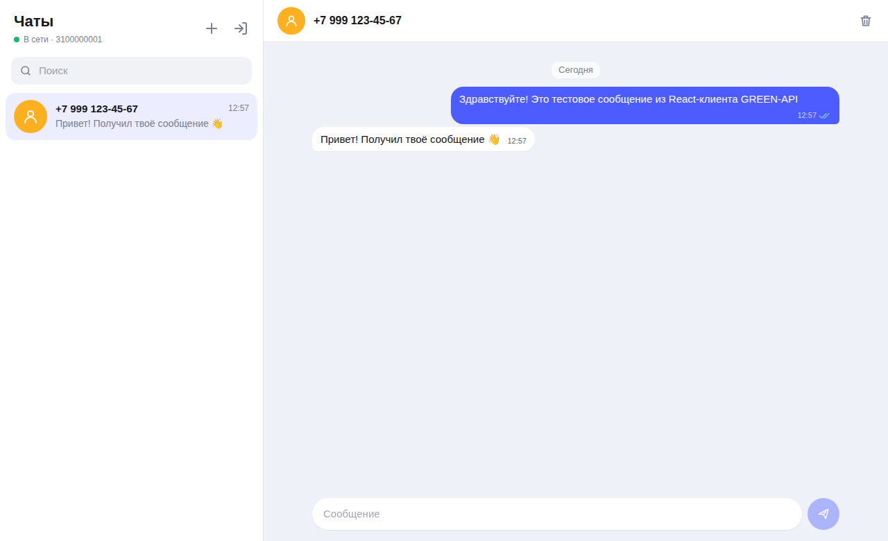
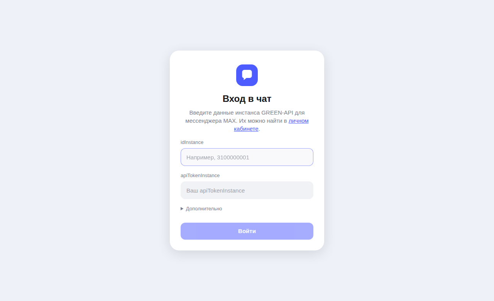
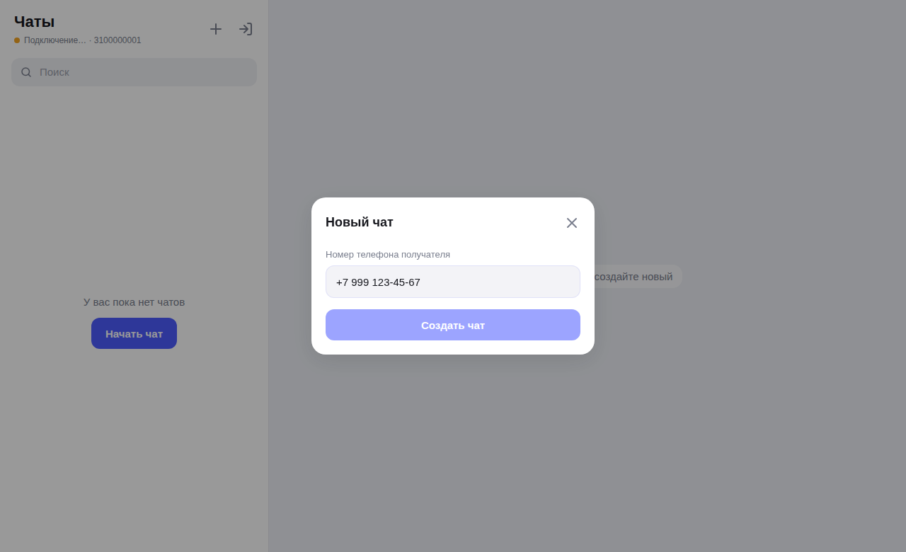
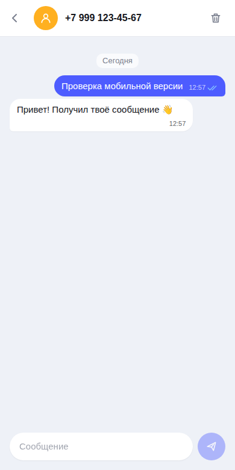

# GREEN-API · MAX Chat

Тестовое задание на должность «Фронтенд-разработчик React».

Простой веб-чат для отправки и получения текстовых сообщений в мессенджере **MAX** через сервис [GREEN-API](https://green-api.com/max). Внешний вид — по мотивам [web.max.ru](https://web.max.ru/).



## Возможности

- Вход по учётным данным инстанса GREEN-API (`idInstance`, `apiTokenInstance`) с проверкой через `getStateInstance`
- Создание чата по номеру телефона получателя (номер → `chatId` MAX через `checkAccount`)
- Отправка текстовых сообщений — [`SendMessage`](https://green-api.com/v3/docs/api/sending/SendMessage/)
- Получение сообщений — [HTTP API](https://green-api.com/v3/docs/api/receiving/technology-http-api/): `ReceiveNotification` → `DeleteNotification` (long polling)
- Статусы исходящих: отправляется / отправлено / доставлено / прочитано / ошибка (с повтором отправки)
- Сообщения, отправленные с телефона, тоже появляются в чате (`outgoingMessageReceived`)
- Входящие от новых собеседников автоматически создают чат, счётчик непрочитанных
- История чатов сохраняется в `localStorage` (по каждому инстансу отдельно)
- Проверка настроек инстанса (`GetSettings`) и включение приёма уведомлений в один клик (`SetSettings`)
- Работает и с инстансами **Telegram** (API GREEN-API одинаковый); сообщения из групп и каналов игнорируются — интерфейс только для личных чатов
- Адаптивная вёрстка (десктоп / мобильный), светлая и тёмная тема

## Быстрый старт

Требования: **Node.js 20+**

```bash
git clone <ссылка-на-репозиторий>
cd green-api-max-chat
npm install
npm run dev
```

Откройте http://localhost:5173

### Подготовка инстанса

1. Зарегистрируйтесь в [личном кабинете GREEN-API](https://console.green-api.com) и создайте инстанс для **MAX** (тариф Developer бесплатный).
2. Авторизуйте инстанс (отсканируйте QR-код в приложении MAX).
3. Для получения сообщений через HTTP API в настройках инстанса поле **`webhookUrl`** должно быть **пустым**, а «Receive webhooks on incoming messages» — **Yes**. Если приём выключен, приложение само покажет предупреждение с кнопкой **«Включить»** (вызывает `SetSettings`; инстанс перезапускается, настройки применяются в течение ~5 минут).
4. Скопируйте `idInstance` и `apiTokenInstance`.

### Проверка сценария

1. Введите `idInstance` и `apiTokenInstance` → «Войти».
2. Нажмите **«+»** и введите номер получателя (например `79991234567`) → «Создать чат».
3. Напишите сообщение и нажмите **Enter** (Shift+Enter — перенос строки).
4. Ответьте с телефона получателя в MAX — ответ появится в чате в течение нескольких секунд.

> По умолчанию используется `apiUrl` = `https://api.green-api.com/v3`. Если в личном кабинете указан другой адрес — измените его в блоке «Дополнительно» на экране входа.

## Скрипты

| Команда           | Описание                          |
| ----------------- | --------------------------------- |
| `npm run dev`     | Dev-сервер                        |
| `npm run build`   | Проверка типов и production-сборка в `dist/` |
| `npm run preview` | Просмотр production-сборки        |
| `npm test`        | Unit-тесты (Vitest)               |
| `npm run lint`    | Линтер (oxlint)                   |

## Стек

React 19 · TypeScript · Vite · CSS без UI-библиотек · Vitest

Сторонних зависимостей в рантайме нет — только `react` и `react-dom`.

## Структура

```
src/
├── api/greenApi.ts            # клиент GREEN-API (fetch, обработка ошибок)
├── hooks/
│   ├── useNotificationPolling.ts  # цикл receiveNotification → deleteNotification
│   └── useChatStore.ts        # useReducer + сохранение в localStorage
├── store/
│   ├── chatReducer.ts         # чаты, сообщения, статусы (чистая функция, покрыта тестами)
│   └── notifications.ts       # преобразование уведомлений GREEN-API в actions
├── components/
│   ├── LoginPage.tsx          # вход по idInstance / apiTokenInstance
│   ├── Messenger.tsx          # основной экран: отправка, polling
│   ├── Sidebar.tsx            # список чатов, поиск
│   ├── NewChatDialog.tsx      # новый чат по номеру телефона
│   ├── ChatWindow.tsx         # окно переписки
│   ├── MessageBubble.tsx
│   └── MessageInput.tsx
└── utils/                     # телефон, даты, localStorage
```

## Технические решения

- **Получение сообщений.** Одновременно выполняется только один запрос `receiveNotification` (`receiveTimeout=5`). После обработки уведомление удаляется из очереди `deleteNotification`. При сетевой ошибке — повтор через 3 с, статус соединения отображается в шапке.
- **Адресация в MAX.** MAX отправляет сообщения по `chatId`, поэтому при создании чата номер телефона конвертируется в `chatId` методом `checkAccount`. Если метод недоступен (лимит, номер вне РФ/РБ), используется формат `79991234567@c.us`; когда приходит эхо отправленного сообщения с настоящим `chatId`, чат автоматически «переключается» на него.
- **Оптимистичная отправка.** Сообщение сразу показывается со статусом «отправляется», затем получает реальный `idMessage`; повторные уведомления о том же сообщении отбрасываются.
- **Нетекстовые сообщения.** По ТЗ поддерживается только текст; для остальных типов показывается пометка «тип не поддерживается».

## Безопасность

Учётные данные хранятся только в `localStorage` браузера пользователя и отправляются напрямую в GREEN-API. Кнопка «Выйти» удаляет их.

## Скриншоты

| Вход | Новый чат | Мобильная версия |
| --- | --- | --- |
|  |  |  |

## Деплой

В репозитории настроен GitHub Actions (`.github/workflows/deploy.yml`): при пуше в `main` запускаются тесты, сборка и публикация на **GitHub Pages**. Нужно один раз включить в настройках репозитория: *Settings → Pages → Source: GitHub Actions*.

Сборка статическая (`base: './'`), поэтому `dist/` можно разместить на любом хостинге (Vercel, Netlify и т. п.).
